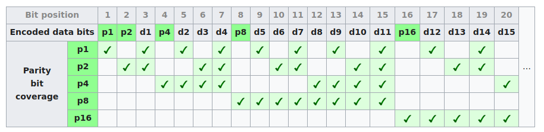

# Hamming Code

[TOC]

## Introduction

These 2 videos give a general introduction of ECC and hamming code:

[How to send a self-correcting message (Hamming codes)](https://www.youtube.com/watch?v=X8jsijhllIA)

<https://www.youtube.com/watch?v=b3NxrZOu_CE>

>  From wikipedia: <https://en.wikipedia.org/wiki/Hamming_code>

Hamming codes can detect **one-bit** and **two-bit** errors, or correct **one-bit** errors without detection of uncorrected errors.

In mathematical terms, Hamming codes are a class of binary linear code. For each integer r ≥ 2 there is a code-word with block length n = 2r − 1 and message length k = 2r − r − 1. Here r is the extra parity bits that used to detect and correct error. k is the message length and n is the total length of the codeword.

For example, in the (7, 4) Hamming Code, r = 3, so the length of the codeword is 2^3 - 1 = 7, the number of data bit is 4 and the number of parity bits is 3.

### General algorithm

> From wikipedia: https://en.wikipedia.org/wiki/Hamming_code#General_algorithm

The following general algorithm generates a single-error correcting  (SEC) code for any number of bits. The main idea is to choose the  error-correcting bits such that the index-XOR (the [XOR](https://en.wikipedia.org/wiki/Exclusive_or) of all the bit positions containing a 1) is 0. 

We use positions 1, 2, 4, ... , 2^n as the error-correcting  bits, which guarantees it is possible to set the error-correcting bits so that the index-XOR of the whole message is 0. If the receiver receives a string with index-XOR 0, they can conclude  there were no corruptions, and otherwise, the index-XOR indicates the  index of the corrupted bit.

An algorithm can be deduced from the following description:

1. Number the bits starting from 1: bit 1, 2, 3, 4, 5, 6, 7, etc.
2. Write the bit numbers in binary:  1, 10, 11, 100, 101, 110, 111, etc
3. All bit positions that are powers of two (have a single 1 bit in the  binary form of their position) are parity bits: 1, 2, 4, 8, etc. (1, 10, 100, 1000)
4. All other bit positions, with two or more 1 bits in the binary form of their position, are data bits.
5. Each data bit is included in a unique set of 2 or more parity bits, as determined by the binary form of its bit position.
   1. Parity bit 1 covers all bit positions which have the **least** significant bit set: bit 1 (the parity bit itself), 3, 5, 7, 9, etc.
   2. Parity bit 2 covers all bit positions which have the **second** least significant bit set: bits 2-3, 6-7, 10-11, etc.
   3. Parity bit 4 covers all bit positions which have the **third** least significant bit set: bits 4–7, 12–15, 20–23, etc.
   4. Parity bit 8 covers all bit positions which have the **fourth** least significant bit set: bits 8–15, 24–31, 40–47, etc.
   5. In general each parity bit covers all bits where the bitwise AND of the parity position and the bit position is non-zero.

The choice of the parity, even or odd, is irrelevant but the same choice must be used for both encoding and decoding.

(Image from wikipedia: https://en.wikipedia.org/wiki/Hamming_code)

### Hamming codes with additional parity (SECDED)

> From wikipedia: https://en.wikipedia.org/wiki/Hamming_code#Hamming_codes_with_additional_parity_(SECDED)

Hamming codes have a minimum distance of 3, which means that the decoder can detect and correct a single error, but it cannot distinguish a  double bit error of some codeword from a single bit error of a different codeword.  Thus, some double-bit errors will be incorrectly decoded as  if they were single bit errors and therefore go undetected, unless no  correction is attempted.

To remedy this shortcoming, Hamming codes can be extended by an extra  parity bit. This way, it is possible to increase the minimum distance of the Hamming code to 4, which allows the decoder to distinguish between  single bit errors and two-bit errors. Thus the decoder can detect and  correct a single error and at the same time detect (but not correct) a  double error.

The additional parity bit is the parity of the codeword.

### Decoding Hamming Code

The decoder calculate the syndrome of the received hamming code. The calculation is very similar to calculating the parity bit, for each syndrome bit, we xor the same data bit position mentioned in step 5 in [General algorithm], and we also xor the parity bit itself. **Note**: We assume the bit start at bit 1 for syndrome, parity and data:

syndrome[1] = Parity[1] ^ d[1] ^ d[2] ^ d[4] ...

syndrome[2] = Parity [2] ^ d[1] ^ d[3] ^ d[4] ...

If the syndrome is zero, then there is no error. 

If syndrome is not zero, then there are error happens. There are multiple cases in this situation:

1. only 1 bit get flipped, then syndrome represent the bit get flipped. (starting from bit 1).
2. 2 bits are flipped, but we don't know which 2 bits are flipped.

If we use SECDED, then the parity bit together tells us which case is value.

1. syndrome == 0 then no error

1. syndrome != 0 and parity != received parity, then 1 bit get flipped and syndrome represent the bit
2. syndrome != 0 and parity == received parity, then 2 bit get flipped.

## Design

| Files                         | Description                   |
| ----------------------------- | ----------------------------- |
| rtl/ecc_hamming_74_encoder.sv | (7,4) Hamming ECC encoder     |
| rtl/ecc_hamming_74_decoder.sv | (7,4) Hamming ECC decoder     |
| rtl/ecc_hamming_encoder.sv    | A generic Hamming ECC encoder |
| rtl/ecc_hamming_decoder.sv    | A genetic Hamming ECC decoder |

