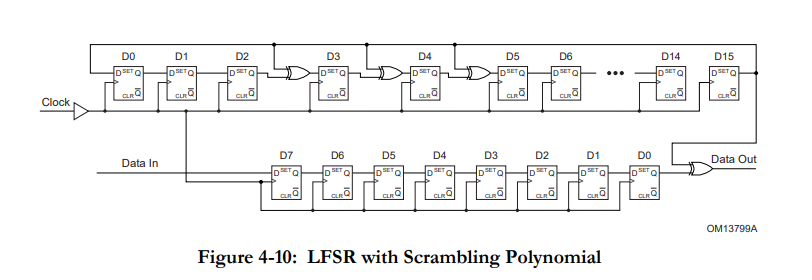

# Scrambling/De-scrambling

This design is in Chapter 6 - 6.2 Scrambling/De-scrambling

[TOC]

## Introduction

> From: https://en.wikipedia.org/wiki/Scrambler

Scrambling is an operation where a serial bit stream is changed to produce a randomized serial bit scream.

Scrambling is done by using LFSR to produce a pseudo random sequence of bit stream and then doing an XOR operation with the serial data.

Later in the receiver side, the received data is XOR-ed with another LFSR to register to restore the original data.

In this achievable due to the following equation:

```
If A ^ B = C, then A = C ^ B
```

### Scrambling Serial Data

To scramble a serial, in each clock cycle, the serial data is XOR-ed with the last bit of the LFSR register.

### Scrambling Parallel Data

In real design, the data comes in parallel so we need to be able to scramble parallel data in the same clock cycle.

To scramble a parallel data with W width, we need to construct a "parallel" LFSR that can "advance" W cycles at a single clock cycle. Imagine the LFSR is running W time faster then the parallel data and during the W clock period, the corresponding bit of the parallel data is XOR-ed with the last bit of the LFSR.

## Scrambler Control

> From the book: **Advanced Chip Design Practical Examples in Verilog**

### Initialize Scramble

PCIe use a character called COM character that the transmitter and the receiver use to initialize the LFSR flops to a known agreed values. The COM character is sent periodically to synchronize the scrambler and de-scrambler periodically.

### Pausing the Scramble

The LFSR advances to a new value each clock cycle but it should be able to pause and not advance when pause signal is asserted.

In PCIe, some symbol such as SKIP is not scrambled so we need to be able to pause the scrambler when we send/receive skip symbol.

### Disabling the Scramble

Scramble should have the capability to not scramble a data but still advance the LFSR flops.

For example in PCIe, training sets (TS1/TS2) are not scramble but the LFSR keeps advancing.

## PCIe Scrambler

PCIe Scrambler is defined in PCIe Specification 3.0 chapter 6.2.7

Polynomial: x^16+x^5+x^4+x^3+1

LFSR Structure (Picture taken from PCIe Specification 3.0 chapter 6.2.7):

 

## Design

| Design                | Description    |
| --------------------- | -------------- |
| rtl/scrambler_pcie.sv | PCIe scrambler |

